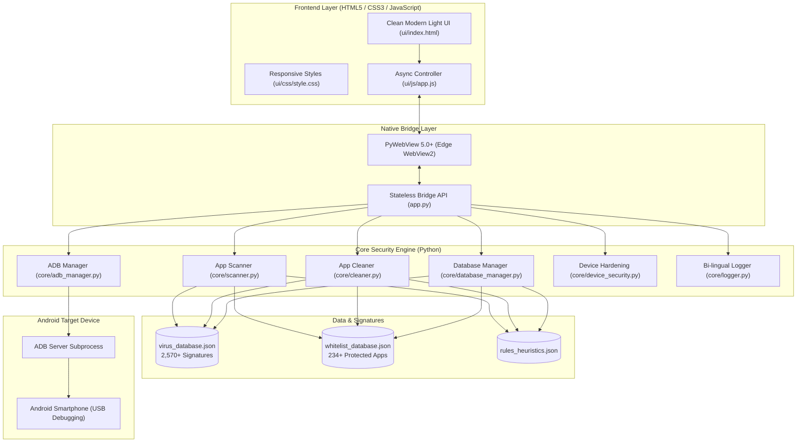

# 🛡️ APKs Guard Pro 289 (Enterprise Android Antivirus & Threat Neutralizer)

[](https://www.python.org/)
[](https://microsoft.com/windows)
[](https://pywebview.flowrl.com/)
[](https://developer.android.com/tools/adb)
[](data/virus_database.json)
[](data/whitelist_database.json)
[](LICENSE)

> **Advanced Android Antivirus, Banking Trojan Neutralizer & Sideloaded Malware Cleaning System for Windows**  
> โปรแกรมตรวจจับ สแกน และกำจัดมัลแวร์ โทรจันดูดเงิน และแอพแอบแฝงสำหรับสมาร์ทโฟน Android ผ่านสาย USB (ADB) พร้อมระบบอัพเดทฐานข้อมูลไวรัสล่าสุด และฟังก์ชั่นล้างแอพทั่วไปทั้งหมดโดยคงไว้เฉพาะแอพธนาคารและโซเชียลมีเดีย

---

## 🌟 จุดเด่นและฟังก์ชันการทำงาน (Key Features)

### 1. 🛡️ Multi-Layer Scanning Engine (5 โหมดสแกนอัจฉริยะ)
1. **⚡ Quick Scan (สแกนเร็ว):** สแกนแอพที่ผู้ใช้ติดตั้ง (User Apps) และเปรียบเทียบกับฐานข้อมูลไวรัสกว่า 2,570+ รายการ
2. **🛡️ Full Deep Scan (สแกนระบบลึก):** สแกนเจาะลึกทั้ง User Apps, System Apps, Disabled Apps และสิทธิ์การเข้าถึงทั้งหมด
3. **🔲 Smart Check (ตรวจจับพฤติกรรมอัจฉริยะ):** ตรวจจับแอพติดตั้งนอก Store (Sideloaded APKs), แอพที่แอบขอสิทธิ์ Accessibility Service เพื่อควบคุมหน้าจอ และพฤติกรรมแปลกปลอม
4. **👁️‍🗨️ Disabled Apps (สแกนแอพปิด):** ตรวจจับมัลแวร์หรือโทรจันที่ถูกสั่งปิดการทำงาน (`pm list packages -d`) แต่แอบแฝงตัวอยู่ในเครื่อง
5. **🧹 Wipe Non-Essential (ล้างแอพทั่วไป ยกเว้นธนาคาร & โซเชียล):** ฟังก์ชั่นพิเศษสำหรับล้างเครื่องฉุกเฉิน ลบแอพ 3rd-party ทั่วไปทั้งหมด โดย **ปกป้องและคงไว้เฉพาะแอพธนาคารไทย, แอพโซเชียลมีเดียหลัก (LINE, Facebook, TikTok, Instagram ฯลฯ) และแอพระบบ** 100%

### 2. 🔄 Live Virus Definitions & Update System
- **ปุ่มกดอัพเดทฐานข้อมูลไวรัสล่าสุด (One-Click Database Update)** แก้ปัญหาล้างไวรัสไม่หมด
- **ระบบแจ้งเตือนอัจฉริยะ (Update Available Badge)** เมื่อมีมัลแวร์ตัวใหม่ในเซิร์ฟเวอร์
- **Custom Blacklist Editor:** เพิ่ม Package Name ไวรัสตัวใหม่ที่เพิ่งค้นพบเข้าสู่ระบบได้ทันที
- **Custom Whitelist Editor:** เพิ่มรายชื่อแอพเฉพาะทางของคุณเพื่อป้องกันไม่ให้ถูกลบ
- **JSON Export / Sync:** ส่งออกและสำรองข้อมูลฐานข้อมูลไวรัสได้ตลอดเวลา

### 3. 📱 Device Security Hardening (เพิ่มความปลอดภัยหลังล้างเครื่อง)
- **ปุ่มปิด USB Debugging (Disable ADB)** ในคลิกเดียว
- **ปุ่มปิดเมนูตัวเลือกสำหรับนักพัฒนา (Disable Developer Options)** ป้องกันไม่ให้แฮกเกอร์ต่อสายเข้าถึงเครื่องซ้ำ
- ตรวจสอบสเปกมือถือละเอียด: ยี่ห้อ, รุ่น, Android Version, หมายเลขบิลด์, Serial Number, สถานะ Root, ระดับแบตเตอรี่
- คำสั่งควบคุมเครื่อง: รีสตาร์ทปกติ, เข้าโหมด Recovery, เข้าโหมด Fastboot / Bootloader

### 4. 📦 Application Manager (จัดการแอพในเครื่อง)
- แสดงรายชื่อแอพทั้งหมดในเครื่องมือถือแบบเรียลไทม์
- ฟิลเตอร์แยกหมวดหมู่: `User Apps`, `System Apps`, `Disabled Apps`, และ `🧹 แอพทั่วไปที่ไม่ใช่ธนาคาร/โซเชียล`
- ค้นหาแอพได้รวดเร็ว (Live Search) พร้อมปุ่มสั่งลบทีละแอพ

### 5. 🔌 USB Drivers & Visual Guide
- ปุ่มติดตั้ง **SAMSUNG Mobile USB Driver** ในตัว
- ปุ่มติดตั้ง **Universal ADB Driver Setup (MSI)** ในตัว
- คู่มือและภาพประกอบขั้นตอนการเปิด USB Debugging แยกตามยี่ห้อ (Samsung, Xiaomi, OPPO, Vivo, Huawei, Infinix ฯลฯ)

### 6. 💻 Device Simulator Mode
- ปุ่มจำลองอุปกรณ์เสมือน (Simulator Mode) บนแถบ Header สำหรับทดสอบปุ่มทุกปุ่มและทุกฟังก์ชันได้ทันที แม้ไม่มีโทรศัพท์มือถือต่ออยู่จริง

### 7. 🎨 Clean Modern Light Theme & Vector SVG
- หน้าจอธีมสีขาวสะอาดตา คมชัด อ่านง่าย ระดับ High-DPI
- ไอคอน Vector SVG คมชัดทุกขนาดหน้าจอ ไม่มีปัญหาอิโมจิเพี้ยน
- ระบบ Non-Blocking Asynchronous Architecture ป้องกันโปรแกรมค้างขณะสแกน 100%

---

## 🏛️ โครงสร้างสถาปัตยกรรมระบบ (System Architecture)



---

## 📂 โครงสร้างโฟลเดอร์โปรแกรม (Project Structure)

```text
Antivirus 289/
├── app.py                     # Entry point & PyWebView Stateless Bridge
├── README.md                  # Comprehensive Documentation
├── .gitignore                 # Git ignore rules (binaries, caches)
├── assets/
│   ├── icon.ico               # High-DPI application icon
│   ├── logo.svg               # Vector brand badge
│   ├── drivers/               # USB Driver Installers
│   └── images/                # UI guide illustrations
├── bin/
│   └── adb/                   # Standalone ADB binaries (adb.exe, DLLs)
├── core/
│   ├── __init__.py            # Module initializer & path resolver
│   ├── adb_manager.py         # Subprocess ADB & Simulator controller
│   ├── scanner.py             # Multi-layer async heuristic scanning engine
│   ├── cleaner.py             # 3-Level batch uninstall engine
│   ├── database_manager.py    # Virus signatures & whitelist database
│   ├── device_security.py     # USB Debugging & Dev options hardening
│   └── logger.py              # Bi-lingual live logging system
├── data/
│   ├── virus_database.json    # 2,570+ Malware signatures
│   ├── whitelist_database.json# 234+ Protected banking & social apps
│   ├── rules_heuristics.json  # Heuristic patterns & suspicious signatures
│   └── config.json            # User preferences & mirrors
├── tests/
│   ├── test_all.py            # 9 Full system integration tests
│   └── test_buttons_and_apis.py # Full button & API automated verification
└── ui/
    ├── index.html             # Application UI markup
    ├── css/
    │   ├── style.css          # Clean modern light theme stylesheet
    │   └── animations.css     # Radar sweep & pulse keyframes
    └── js/
        └── app.js             # Non-blocking async frontend dispatcher
```

---

## 🚀 การติดตั้งและเปิดใช้งาน (Getting Started)

### ข้อกำหนดระบบ (Prerequisites)
- **Windows 10 / Windows 11 (64-bit)**
- **Python 3.10+** (กรณีรันจาก Source Code)
- **Microsoft Edge WebView2 Runtime** (ติดตั้งมาพร้อมกับ Windows 10/11 เป็นมาตรฐาน)

### 1. โคลนโปรเจค (Clone Repository)
```bash
git clone https://github.com/Sirawit45/Antivirus-289.git
cd Antivirus-289
```

### 2. ติดตั้ง Dependencies
```bash
pip install pywebview pyinstaller
```

### 3. รันโปรแกรม (Run Application)
```bash
python app.py
```

### 4. รันการทดสอบระบบ (Run Unit Tests)
```bash
python -m unittest tests/test_all.py
python -m unittest tests/test_buttons_and_apis.py
```

---

## 📦 การ Compile เป็นไฟล์ Executable (.exe)

สามารถคอมไพล์โปรแกรมให้ออกมาเป็นไฟล์ Standalone `.exe` ที่ไม่มีหน้าต่างดำ CMD (Zero-Console Windows Subsystem) ด้วยคำสั่ง:

```powershell
pyinstaller --noconsole --onefile --name="APKsGuardPro289" --icon="assets/icon.ico" --add-data="ui;ui" --add-data="data;data" --add-data="assets;assets" --add-data="bin;bin" app.py
```

ไฟล์ executable จะอยู่ที่ `dist/APKsGuardPro289.exe`.

---

## 🛡️ รายชื่อแอพที่ได้รับการปกป้อง (Whitelisted Ecosystem)

ระบบมีระบบ **Whitelist Protection** ฝังในตัวเพื่อป้องกันการลบแอพสำคัญของผู้ใช้โดยเด็ดขาด:
- **แอพธนาคารไทย (Official Thai Banking):** K PLUS, SCB EASY, Krungthai NEXT, เป๋าตัง, KMA Krungsri, ttb touch, Bangkok Bank, MyMo by GSB, BAAC Mobile, Dime! by KKP, TrueMoney, ShopeePay, Kept by Krungsri, Make by KBank, LHB You, CIMB THAI, UOB TMRW, InnovestX ฯลฯ
- **แอพโซเชียลและการสื่อสาร (Social & Communication):** LINE, Facebook, Messenger, TikTok, Instagram, WhatsApp, Telegram, X (Twitter), Discord, Threads, WeChat, YouTube
- **แอพไลฟ์สไตล์และอีคอมเมิร์ซ (E-Commerce & Delivery):** Shopee, Lazada, Grab, LINE MAN, Robinhood, foodpanda, 7-Eleven TH
- **ระบบพื้นฐาน (Google & OEM Framework):** Google Play Services, Play Store, Android System UI, Google Photos, Drive, Maps, Gmail ฯลฯ

---

## 📄 License & Credits

- พัฒนาและวิจัยโดย: **Sirawit45 & Antivirus 289 Security Lab**
- เอกสารและโค้ดทั้งหมดเผยแพร่ภายใต้ลิขสิทธิ์ [MIT License](LICENSE)
